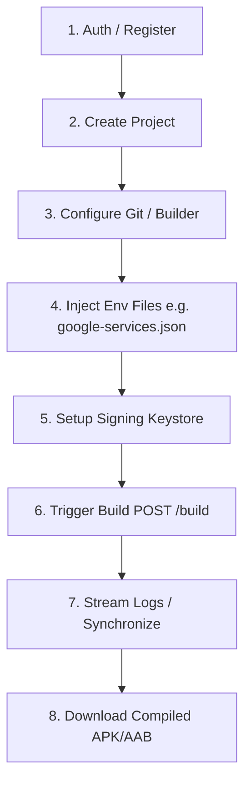

# Flotio Core API Workflow Documentation

This document describes the key end-to-end user workflows in the Flotio CI/CD core engine. 

---

## 🗺️ Architectural Workflow Overview



---

## 🔒 1. Authentication Flow

Authentication is based on secure JWT access and refresh tokens.

### A. Register a New Account
* **Endpoint:** `POST /auth/register`
* **Body:**
```json
{
  "email": "developer@example.com",
  "username": "devguy",
  "password": "StrongPassword123!"
}
```
* **Response (200 OK):**
```json
{
  "user": {
    "id": 1,
    "email": "developer@example.com",
    "username": "devguy"
  },
  "token": "eyJhbGciOi...",
  "refresh_token": "d7a4b8..."
}
```

### B. Authenticate / Login
* **Endpoint:** `POST /auth/login`
* **Body:**
```json
{
  "email": "developer@example.com",
  "password": "StrongPassword123!"
}
```
* **Response (200 OK):** Returns new JWT access and refresh tokens.

> [!NOTE]
> For all subsequent requests, include the access token in the `Authorization` header:
> `Authorization: Bearer <access_token>`

---

## 📁 2. Project Management & Configuration Flow

Projects integrate the builder configuration directly into the core resources using a rich, nested `config` object.

### A. Create a Project
Initializes a project with its main repository connection and basic builder information under the unified `config` nested block.
* **Endpoint:** `POST /project`
* **Body:**
```json
{
  "name": "My Flutter Mobile App",
  "config": {
    "project_path": ".",
    "flutter_version": "3.19.0",
    "git_repo": "https://github.com/my-org/my-flutter-app.git",
    "git_username": "oauth2",
    "git_token": "ghp_PersonalAccessToken"
  }
}
```
* **Response (200 OK):**
```json
{
  "project": {
    "id": 12,
    "created_at": "2026-05-18T11:00:00Z",
    "name": "My Flutter Mobile App",
    "user_id": 1,
    "config": {
      "project_id": 12,
      "platforms": ["android"],
      "flutter_version": "3.19.0",
      "project_path": ".",
      "git_repo": "https://github.com/my-org/my-flutter-app.git",
      "git_username": "oauth2"
    }
  }
}
```

### B. Complete Project Configuration Setup (Advanced Settings)
Below is the **exhaustive** schema for updating a project's configuration, including platforms, build triggers, scripts, unit tests, Google Play signing/distribution, and email alerts.
* **Endpoint:** `PUT /project/12`
* **Body:**
```json
{
  "name": "My Flutter Mobile App - Prod",
  "config": {
    "platforms": ["android", "ios"],
    "build_trigger": "commit",
    "watched_branch_patterns": [
      { "pattern": "main", "type": "include", "target": "target" },
      { "pattern": "feat/*", "type": "exclude", "target": "source" }
    ],
    "watched_tag_patterns": [
      { "pattern": "v*", "type": "include" }
    ],
    "env_variables": [
      { "key": "API_URL", "value": "https://api.my-app.com" },
      { "key": "APP_ENV", "value": "production" }
    ],
    "dependency_caching": true,
    "dependency_dirs": [
      ".pub-cache",
      "build"
    ],
    "webhook_urls": [
      "https://notifications.my-org.com/webhooks/flotio"
    ],
    
    "// Scripts": "Custom shell hooks executed in sequence during containerized build runs",
    "post_clone_script": "echo 'Clone complete!' && flutter precache",
    "pre_test_script": "flutter pub get",
    "post_test_script": "echo 'Tests finished!'",
    "pre_build_script": "dart run build_runner build --delete-conflicting-outputs",
    "post_build_script": "echo 'Build finished!'",
    "pre_publish_script": "echo 'Signing app...'",
    
    "// Testing Config": "Configure how automated testing runs are handled",
    "test": true,
    "enable_flutter_analyze": true,
    "flutter_analyze_args": "--fatal-warnings",
    "enable_flutter_test": true,
    "flutter_test_args": "--coverage",
    "enable_flutter_driver": false,
    "flutter_driver_args": "",
    "flutter_driver_targets": [],
    
    "// Build Settings": "Compilation environment and CLI parameters",
    "flutter_version": "3.19.0",
    "xcode_version": "15.2",
    "cocoapods_version": "1.15.0",
    "project_path": ".",
    "android_build_format": "aab",
    "build_mode": "release",
    "android_build_args": "--no-shrink",
    "ios_build_args": "--no-codesign",
    "web_build_args": "",
    
    "// Distribution & Signatures": "Publishing outputs straight to mobile app stores",
    "enable_android_code_signing": true,
    "enable_google_play_publishing": true,
    "google_play_credentials_json": "{ \"type\": \"service_account\", ... }",
    "google_play_track": "production",
    "update_priority": 2,
    "rollout_fraction": 0.1,
    "do_not_send_for_review": false,
    "submit_as_draft": false,
    "publish_even_if_tests_fail": false,
    
    "// Notifications": "Keep the engineering team up to date",
    "enable_email_notifications": true,
    "email_recipients": [
      "lead-developer@example.com",
      "qa-team@example.com"
    ]
  }
}
```

---

## 📄 3. Injecting Environment Config Files (`/env`)

For sensitive environment configuration files (such as Firebase's `google-services.json` or custom `.env` secrets) that shouldn't live in source control, upload them as user-level assets and associate them with a project.

### A. Upload a File
* **Endpoint:** `POST /env`
* **Body:**
```json
{
  "project_id": 12,
  "key": "google-services.json",
  "type": "file",
  "path": "android/app/google-services.json",
  "value": "eyAiYXBpX2tleSI6ICJBSXphU3lBLS4uLiIgfQ==", // Base64 encoded file content
  "is_base64": true
}
```

> [!TIP]
> At build time, the builder automatically loads all user environment assets linked to your `project_id`, generates secure Kubernetes `ConfigMap` containers, and mounts them inside the build pod at their exact designated target paths (e.g., `/workspace/android/app/google-services.json`).

---

## 🔑 4. Managing Signing Keystores & Credentials (User-Level Assets)

Sensitive signing assets belong directly to the User. Instead of uploading new keystores per project, you manage them under a shared account inventory and link them cleanly in your project configs.

### A. Upload a Signing Keystore
* **Endpoint:** `POST /keystore`
* **Body:**
```json
{
  "name": "production-key",
  "keystore_file": "MIIJrQYJKoZIhvcNAQcCoIIJn...", // Base64 encoded Keystore file
  "store_password": "keystore-passphrase",
  "key_alias": "upload-alias",
  "key_password": "alias-passphrase"
}
```
* **Response:** Returns the Keystore ID (e.g. `3`).

### B. Upload Google Play Credentials
* **Endpoint:** `POST /google-play-credentials`
* **Body:**
```json
{
  "name": "google-play-prod",
  "credentials": "eyAidHlwZSI6ICJzZXJ2aWNlX2FjY291bnQiLCAuLi4gfQ==" // Base64 JSON service account key
}
```
* **Response:** Returns the Credentials ID (e.g. `5`).

### C. Linking Assets to a Project
To activate these assets for a project build, simply set the linked IDs inside your project's nested config:
```json
{
  "config": {
    "enable_android_code_signing": true,
    "keystore_id": 3,
    "enable_google_play_publishing": true,
    "google_play_credentials_id": 5
  }
}
```

---

## 🚀 5. Build Execution & Monitoring Flow

Trigger, watch, and download compiled mobile application binaries.

### A. Trigger a Build
Kick off a containerized Kubernetes build pod.
* **Endpoint:** `POST /project/12/build`
* **Body:**
```json
{
  "platform": "android",
  "build_mode": "release",
  "build_target": "apk",
  "git_branch": "main"
}
```
* **Response (200 OK):**
```json
{
  "build": {
    "id": 104,
    "created_at": "2026-05-18T11:42:00Z",
    "project_id": 12,
    "status": "pending",
    "platform": "android",
    "duration": 0
  }
}
```

---

## 📋 6. Log Synchronization Flow

Logging is designed for both on-demand retrieval and real-time syncing.

### A. Fetch Current Static Logs
Retrieve all generated logs for a build up to the current moment.
* **Endpoint:** `GET /project/12/build/104/logs`
* **Response:**
```json
{
  "logs": [
    "[11:42:05] Cloning git repository...",
    "[11:42:10] Resolving flutter dependencies...",
    "[11:42:25] Compiling APK..."
  ]
}
```

### B. Stream Logs in Real-time (Sync)
To stream the runner logs live in your browser/console:
* **Endpoint:** `GET /project/12/build/104/logs/sync`
* **Behavior:** Streams the log lines sequentially via server-sent chunks as they are generated by the active build pod.

---

## 📥 7. Downloading the Compiled Binary

When the build status changes to `"success"`, a secure S3-based download URL is generated for your artifact.
* **Endpoint:** `GET /project/12/build/104/download`
* **Behavior:** Automatically redirects you to, or returns the secure presigned download link for, the compiled binary (e.g. `app-release.apk`).

---

## 📦 8. Core Storage & Assets Architecture

Flotio optimizes performance, security, and efficiency by combining high-speed relational storage with secure binary object storage:

### A. Relational Database (PostgreSQL) — Sensitive Assets & Credentials
For maximum security and instantaneous Kubernetes provisioning, small, sensitive environment config files and credentials (e.g., Android Keystores, Google Play Credentials, `.env` files) are stored directly inside the PostgreSQL database as **Base64-encoded strings**.

* **Why Postgres?**
  * **Instant Mounting:** When a builder pod starts, the API retrieves the base64 string directly from the database and constructs a Kubernetes `Secret` or `ConfigMap` in-memory. This eliminates any S3/network overhead to download active keys at pod startup.
  * **Advanced Encryption:** Enables straightforward row-level encryption and secure vault storage patterns for sensitive passwords and signature keys.

### B. Object Storage (S3 / MinIO) — Large Build Binaries & Artifacts
Large compiled artifacts (like `.apk` or `.aab` packages) and large dependency cache archives (`.tar`) are uploaded directly from the container runners to private **AWS S3 / MinIO buckets**.

* **Asset Organization:** Files are organized using structured S3 prefixes:
  * Artifacts: `builds/<build_id>/app-release.apk`
  * Dependency Caches: `caches/<project_id>/.pub-cache.tar`
* **Secure Distribution:** Downloading artifacts generates a time-restricted, secure **S3 Presigned URL**, ensuring your binary packages remain private and protected at all times.

